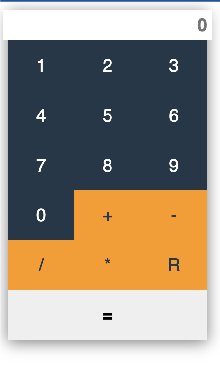

# calculator-vue

Простой Калькулятор, реализованный на фреймворке Vue.



## Установка:

Устанавливаем и активируем виртуальное окружение

```
cd calculator-vue
npm run build
```

Запускаем

```
npm run dev
```
